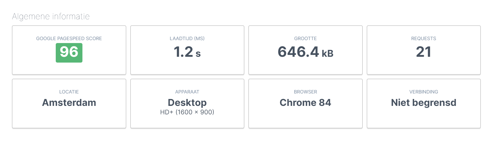

# Traveltips, get help and discount for your dream trip!

Ever wanted to make a trip far away? Don't look further than!
We from Traveltips provide you 3 **dream destinations.** You are able to choose between the Netherlands, Canada and Italy. For each of those destinations we will give you all the practical information, discounts and a possibility to personalize your trip!
 
Just look around at our website, and if you find your perfect destination book it ASAP, so you will get **the biggest discounts!** And if you have any questions, don’t hesitate to get in touch with us.

 
# Deployment and Demo of the site

Website has been deployed to [GitHub Pages](https://waterrot.github.io/traveltrips/).

# UX

I made a simple and mobile friendly website with an eye for speed and readability. It also contains modals, jumbotrons, accordions, links, button e.g.

- Home page: Contains a slider with 3 slides. on each slide you have a picure with a jumbotron. on the jumbotron you have some text and a button to the page where the picture is about. And on the bottom of the page are 3 cards about all the countries who is responsive, 1 card will disapear on tablet size and on mobile size they will be under eachother.
- About us page: Contains a picure with a jumbotron with an image and some text about our vision. And on the bottom of the page are 3 cards about all the people that work at the company, this one is also responsive, 1 card will disapear on tablet size and on mobile size they will be under eachother.
- Canada page: first a couple of information sections with images (with alt text) and text and links to the modal where they can get in touch. and under that is a section with an accordion effect, a field with text and links will pop up when you click on the accordion button.
- Netherlands page: first a couple of information sections with images (with alt text) and text and links to the modal where they can get in touch. and under that is a section with an accordion effect, a field with text and links will pop up when you click on the accordion button.
- Italy page: first a couple of information sections with images (with alt text) and text and links to the modal where they can get in touch. and under that is a section with an accordion effect, a field with text and links will pop up when you click on the accordion button.

## Features

In this section, you should go over the different parts of your project, and describe each in a sentence or so.
 
### Existing Features
- book now button - users of the website click on it and a modal with a form will pop up
- button cards home page - user clicks on it and will go to the page of the country they clicked on.
- button in slider - user clicks on it and will go to the page of the country they clicked on.
- accordion button - when the user clicks on the accordion button on one of the country pages, a text area will pop up with links where they can click on.

### Features Left to Implement
- user makes real reservation with payment optional
- user chats with a chatbot on the right downside of the screen.

## Technologies Used

In this section, you should mention all of the languages, frameworks, libraries, and any other tools that you have used to construct this project. For each, provide its name, a link to its official site and a short sentence of why it was used.

- [Bootstrap](https://bootstrap.com)
    - The project uses **Bootstrap** to build faster and use the classes Bootstrap has already written.

- [fontawesome][https://fontawesome.com]
    - I used **fontawesome** to display icons on the website.

## Wireframe

The wireframe was designed with the help of [Balsamiq](https://balsamiq.com/wireframes/) and links to the final version can be found below:

- [Wireframe Final Version](https://github.com/waterrot/traveltrips/blob/master/wireframe-project-raymond.pdf)

## Testing
In the next picture you can see that I safed a lot of time with compressing all the images:

The result of this and the way I coded result in a fast website who almost loads under 1s and is less then 1 MB.

to run the same test simply go to this [site](https://www.uptrends.nl/tools/website-speed-test)
pasted the url in the section and click start.

## Credits

### Content
#### our vision text
https://travmic.com/our-approach-vision-mission/

#### text why visit canada
https://www.tripsavvy.com/reasons-to-visit-canada-1481722 

#### text spirit island canada page
https://www.banffjaspercollection.com/attractions/maligne-lake-cruise/stories/how-to-get-to-spirit-island/

#### text Colombia Icefield canada page
https://www.banffjaspercollection.com/attractions/columbia-icefield/experience/ 

#### text why visit italy
https://www.udrive.com.au/blog/reasons-to-visit-italy/

#### text Colosseum italy page
https://www.rome.net/colosseum

#### text Altare della patria italy page
http://getarounditaly.com/attractions/rome-attractions/altare-della-patria

#### text vatican italy page
https://inacitynearyou.net/5-reasons-to-visit-the-vatican/

#### text why visit the Netherlands
https://www.lonelyplanet.com/the-netherlands

#### text loosdrechtse plassen netherlands page
https://www.iamsterdam.com/en/see-and-do/things-to-do/nature/overview/loosdrechtse-plassen

#### text amsterdam light festival netherlands page
https://www.iamsterdam.com/en/see-and-do/whats-on/major-events-and-celebrations/amsterdam-light-festival

#### text National Maritime Museum netherlands page
https://www.hetscheepvaartmuseum.com/

### Media

## photo on about-us page 
https://unsplash.com/photos/Yui5vfKHuzs

the rest of all the photo where taken by myself.

### Acknowledgements

#### footer
Code from the mini project "make your own cv" of the Code Instituut was the basic inspiration for the footer.
to make it a bit more interactive I used:
https://ianlunn.github.io/Hover/ to give a delay in the color change when you hover over one of the links in the footer.
To make the email clickable I used https://www.handleidinghtml.nl/html/hyperlinks/hyperlinks09.html as inspiration.
To make the phone number clickable I used https://webdev-il.blogspot.com/2011/03/how-to-make-html-link-to-call-phone.html as inspiration.

#### basic structure
I used a lot of Bootstrap to make the website look nice. When I needed to create a new element I used Bootstrap for a basic structure and then customized it to make it fit into my website.

